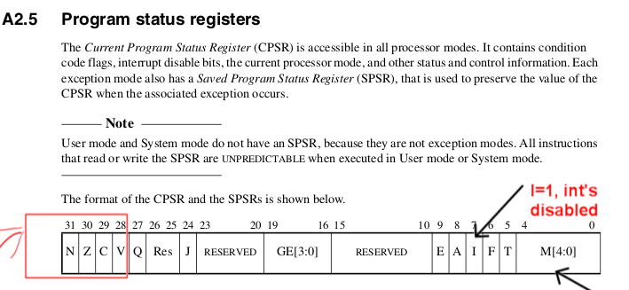

---

marp: true
theme: default
paginate: true

---


# Lab 4: interrupts 

**Stanford Winter 2026**

---

# Executing is main gerund in Turing World

In this class we will exhaust all angles:
 - interrupts (today)
 - exceptions (today)
 - non-preemptive threads (thursday)
 - pre-emptive user process (couple weeks)
 - kernel process (sort of all labs)
 - single stepping vs regular (soon)

---
# Today's mission.

Artifacts:
 1. Complete working interrupt example (only few pages!)
 2. Use to make a statistical profiler (+ < 50 lines)
 3. Working system calls (!)

Knowledge(s):
 - How the code runs on the raw machine. Confused? Change and re-run
 - How all the pieces fit together: `config.txt`, `memmap`, `*.list`
 - How to use armv6 + bcm datasheet to do real stuff.

---
# Our ethos

No fake bullshit:
 - Everything runs raw on hardware.
 - Everything is small.
   - Read it; tweak it; repeat 5x = you'll understand fr.

Because small and we control everything: 
  - Can do things hard/impossible on "real" OS.

Rest of slides:
 - ~ every fact you need to do the lab

---
# Crash course 1: everything needed to run code
 
- (You need to understand for `gprof`)

---
# First: where does the CPU start running?

                                                             
                                                         
  <style scoped>                                                                
  section {                                                                     
    display: flex;                                                              
    flex-direction: column;                                                     
    justify-content: flex-start;                                                
  }                                                                             
  h1 {                                                                          
    margin-bottom: 0;                                                           
  }                                                                             
  div {                                                                         
    flex: 1;                                                                    
    display: flex;                                                              
    justify-content: center;                                                    
    align-items: center;                                                        
    text-align: center;                                                         
    font-size: 2em;                                                             
  }                                                                             
  </style>                                                                      
                                                                                
  <div>???</div>                                                                
                                

---
# First: where does the CPU start running?

`firmware/config.txt`:

```
gpu_mem=64

arm_freq=700
core_freq=250

kernel=kernel.img        <--- the program that runs.
kernel_address=0x8000    <--- where loader will jump to.

# on the pi zero w you need this line or it won't work.
# zhouheng sun found this!
enable_uart=1
```

---
# Ok: how to define what runs at `0x8000`?

---
# Ok: how to define what runs at `0x8000`?

`libpi/memmap`: linker script that tells `ld` how to lay out code.
<style scoped>                                                              
   pre { font-size: 20px; }                                                    
</style>                                                                    
```
SECTIONS {
    .text 0x8000 :  {
        __code_start__ = .;     <---- label: you will use <gprof>
        KEEP(*(.text.boot))     <---- put <text.boot> first (see: start.S)
        *(.text*)               <---- rest of the code ("text")
        __code_end__ = .;       <---- label: you will use <gprof>
    }
    .data : {
            *(.data*)
    }
    .bss : {
        __bss_start__ = .;      <---- zero filled data (why need this?)
        *(.bss*)
        *(COMMON)
        __bss_end__ = .;
        __prog_end__ = .;
    }
}
```

---
# Ok: what instruction to put at 0x8000?

- `main()`?  `notmain()`?

---
# Ok: what instruction to put at 0x8000?

`libpi/staff-start.S`:
```
.section ".text.boot"
_start:
    mov sp, #0x8000000  @ initialize stack pointer (why this value?)
    @ bl notmain        @ we could jump right to notmain
    bl _cstart          @ instead: call our code to do initialization (?)
    bl rpi_reboot       @ if they return just reboot. (if not?)
```

Disassembly (`timer.list`):
```
@ program  | instruction|  assembly
@ address  | encoding   | instruction
00008000 <__code_start__>:
    8000:   e3a0d302    mov sp, #134217728  ; 0x8000000
    8004:   eb0002be    bl  8b04 <_cstart>
    8008:   eb00032e    bl  8cc8 <rpi_reboot>
```

---
# Ok: what does cstart do?

```
`libpi/staff-src/cstart.c`:
void _cstart() {
    // Q: why this?
    gcc_mb();
    uint8_t * bss      = (void*)__bss_start__;
    uint8_t * bss_end  = (void*)__bss_end__;
    while( bss < bss_end )
        *bss++ = 0;
    gcc_mb();
    ... 
    uart_init();
    notmain();
}
```


---
# Crash course 2: how-to user/kernel/interrupt code

---
# The Matrix (A2-5: memorize)


---

# Mechanics (memorize)

Modes:
- User: Unprivileged. 
- Privileged: System, Super, Abort, Undef, Int, Fast Int

Switch modes:
 - System call, exception, interrupt.
 - Or: (if privileged) by changing CPSR.

Registers:
- One single copy of r0-r7, PC, CPSR registers.
- Two copies of:  r8-r12 (FIQ vs world)
- Privileged modes but System have private copies of r13, r14, SPSR.

---

<style scoped>                                                                
section {                                                                     
    justify-content: flex-start;                                                
}                                                                             
h1 {                                                                          
    position: absolute;                                                         
    top: 80px;                                                                  
    left: 80px;                                                                 
    margin: 0;                                                                  
}                                                                             
</style>                                                                      
# SPSR/CPSR [A2-11]                              
                                                                                


---
# Ok: but Y?

Don't want user to do kernel stuff:
  - So have Priv / Unpriv (pretty close to universal).
  - Why system call?

When get an interrupt/exception: all registers are live
 - Need some way to know where you got an exception (register?)
 - Need to set PC to something (what happens to old?)
 - Need some way to point somewhere to save registers:
   - Stack?  Requires legal stack pointer *all time*.
   - Various Register hacks: scratch registers, shadows, register windows
---

# Crash course 3: Code: how to setup interrupts.

- see the code: `0-timer-int` 
---
