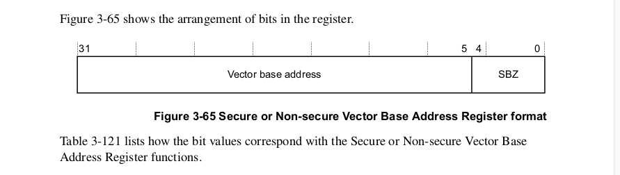
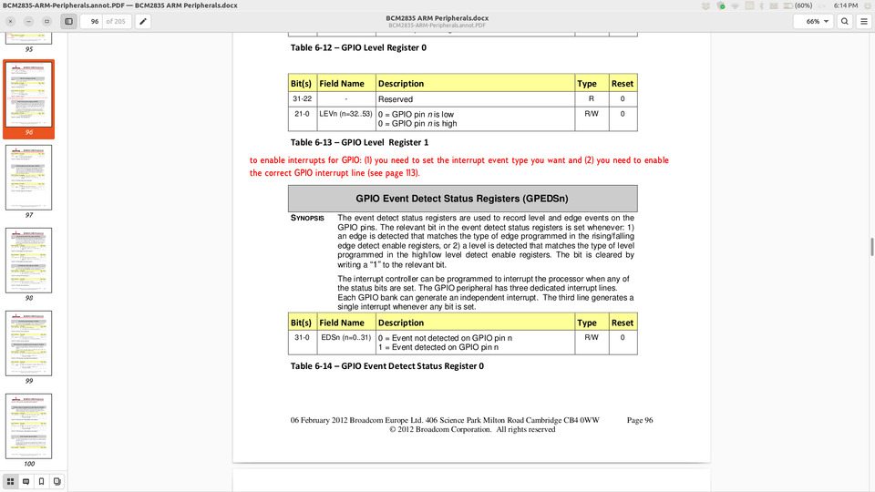

## Lab: device interrupts 

  

One of the most common "tricky things" you'll do is to use device
interrupts to get notified when a hardware device has input (e.g., when
doing networking or a final project).  One of the more common efficiency
things you'll do is try to make this fast.  (If you want a fun major
extension: the first lab of 340lx-25 goes crazy on interrupts.)

So today we'll do both:
  - we'll setup the pi so you can get GPIO interrupts;
  - speed up the interrupt handling code;

We'll use  these to finish building your sw-uart and check that it makes
sense by using interrupts to measure exactly when your sw-uart writes
to GPIO.

Check-off:
  1. `1-vector-base` passes `make check` and you see about a 30% speedup
      from changing `ldr` to the relative branch `b` instruction.  You
      copy your `vector-base.h` to `libpi/include/vector-base.h`
  2. `2-gpio-int` passes `make check` with all the tests.  You copy 
      `gpio-int.c` to your `libpi/src` and change the `libpi/Makefile`
      to use it..
  3. `3-handlers-gpio-int` passes `make check` with all the tests.
  4. `4-logic-analyzer`: Your `sw_uart_put8` gives
     reasonable values for its timings (around 6000 cycles).
  5. Ideally: You have the basic `sw_uart_get8` interrupt working and can send
     back and forth.

There are a ton of [EXTENSION](./EXTENSIONS.md).  We actually have a
bunch that are not written, so ask if you want :).

------------------------------------------------------------------------
### GPIO interrupt enable cheat sheet

The [PRELAB](PRELAB.md) has more discussion, but to save time here's
the main figures from the BCM2835 document you need.

Vector base register layout --- the SBZ 0s can't be set: this is
why we need 32-byte alignment (2^5):

  

  

GPIO enable rising edge (p97):

  

The GPIO interrupts are in the big table (49, p113):

  

Interrupt enable 2 (where 49%32 goes, p117):

  

GPIO event detect (p96):

  

GPIO enable falling edge (p98):

  

GPIO enable rising edge (p97):

  

------------------------------------------------------------------------
### Part 1: use the vector register: `1-vector-base`

For this you'll do some simple tricks to speed up your interrupt
code and make it more flexble by using the vector base register.

The vector base register is an extension for the arm 1176 processor,
but isn't in the general arm family.  it's a good reason to read through
chapter 3 of the arm 1176 which defines a ton of weird instructions.

Some of the reasons we do the vector base reg:
  1. We want to be able to protect page 0 so segfaults will actually
     fault;
  2. It lets us use relative jumps rather than absolute (since the
     jump table doesn't move), which will be faster since it does
     not require a memory load;
  3. We won't have to do anything special when we enable the icache
     (or dcache) since we don't copy code and thus don't have to make
     the icache consistent w/ memory or the dcache.

You'll write the inline assembly to set the vector base.  See:
  - Page 3-121 in `../../docs/arm1176.pdf` for the actual instruction.
  - `libpi/include/cycle-count.h` for an example.

What to do:
  1. Write the code in `1-vector-base/vector-base.h`.
  2. Change the one line in `1-vector-base/interrupt-asm.S` (search for
     TODO) to do a relative branch to `sys_plus1_handler`.
  3. There are two tests: `0-test-checks.c` makes sure you have some of
     the checks and `1-test-run.c` does some timings.  You should see
     over 30% performance improvement.
  4. When the tests pass, `mv` your `vector-base.h` file to `libpi/src` and make
     sure `make check` still passes.

------------------------------------------------------------------------
### Part 2: Implement `2-gpio-int/gpio-int.c`

You should implement the code in `gpio-int.c`: this will mirror 
your `gpio.c` code.

***IMPORTANT***:
 1. You cannot use raw GPIO addresses: each has to have an enum
    and a page number / commment as to why you're doing what you're doing.
 2. Unlike the last lab, you won't have to debug on the raw hardware
    first, there is a fake pi implementation in `2-gpio-int`. To make
    things easy we give you all the `.out` files.  You should be able
    to compare yours to ours (`make check`) / your partners and see that
    everyone has the same thing.

Notes:
  1. Your routines should `panic` if their input pin is >= 32 (not 53:
     we are only doing exposed pins).   I did this check before 
     issuing a `dev_barrier`.
  2. I enabled the GPIO address before the Broadcom interrupt controller.
  3. The interrupt controller is a different device from GPIO so we need
     dev barriers between them.
  4. We don't know what we were going before the GPIO calls, so always 
     do a dev barrier before and after.
  5. You should just write to `IRQ_Enable_2` not RMW.

You probably want to work on one routine at a time.
  - the `6-*.c` tests are the easiest.
  - The `7-*.c` tests should be a formality if 6 pass.

You're going to detect when the input transitions from 0 to 1 and 1 to 0.
To reduce the chance we can a spurious spike from noise we are going to
use the GPIO `GPREN` and `GPHEN` registers on page 98 of the broadcom
that will wait for a `011` for low-to-high and a `100` for high-to-low.
(Note that we could do such suppression ourselves if the pi did not
provide it.)

------------------------------------------------------------------------
### Part 3: Implement GPIO interrupt handlers in `3-handlers-gpio`

You'll  now write the handlers that use your `gpio-int.c` implementation
(in `test-interrupts.c`).

While the code you write will be pretty small, this directory has a
lot of tests to hopefully isolate any issues.  Don't get worried by
the line-count.

NOTES: 
  1. Before you start attach a jumper from pin 20 to pin 21 (i.e.,
     have a loopback setup) so that the tests work.***
  2. `make check` should pass since it uses our code.  After it 
      passes swap the targets in the `Makefile` to use your code.
  3.  As a cheatcode: If you get stuck debugging, you can quickly 
      swap our versions back in to isolate.
  4. The tests have alot of internal checking: so just do `make run`
     rather than `make check` initially to see what is going on.  This
     will be easier than diagnosing `make check` failures.

All the code you write will be in `test-interrupts.c`
  1. Just search for the `todo` macros.
  2. You'll write handlers for rising and falling edges, and timer
     intrrupts (just steal the handler code you need from lab 4).
  3. Make sure you increment the global variables `n_interrupt`,
   ` n_rising`, `n_falling` in your interrupt handlers as appropriate.

The tests:
  - `1-*` do a single event.
  - `2-*` do multiple types of events, once each.
  - `3-*` do multiple types of events, many times each.

Other code:
  - `interrupts-asm.S` just has the timer interrupt trampoline.

------------------------------------------------------------------------
### Part 4: a simple digital analyzer : 4-logic-analyzer

Interrupts often make everything worse.  Using them to make an internal
logic analyzer is a case where you can use them to find bugs in your
code before you use it live.  In this case: if you run your software
uart `sw_uart_put8` on the loop-back pin from the previous part, your
interrupt handler will catch all the transitions.  We will use that to
make sure your code works.

  1. Look in `logic-analyzer.c`
  2. Modify the interrupt handler to catch and record (using cycles) when 
     it was triggered using the circular buffer implementation
     from Part 0.  (or write your own).
  3. At the end, print out the times.
  4. They should match what we want!   (around 6000 cycles per bit)

NOTE: 
  - `make check` doesn't work (we don't know what to compare to)
    so do a `make run` and see that the cycles are around 6000.
  - Once the logic analyzer code works, make sure you switch
    the `4-logic-analyze/Makefile` to use your `sw-uart.c`.  You may also
    have to switch your `libpi/Makefile` to use `libpi/src/sw-uart.c` (and
    stop using the staff) if you haven't already (and copy `sw-uart.c`
    from last lab there if you didn't already).
  - You can also do `sw_uart_get8`.   Of course, it is waiting for bits
    rather than writing them.  As a simple hack, you can just have it write
    to the loopback pin as well and then measure when these occur.

You can look at lab 1 in 340lx to see how far you can push speed for
this code. (You can get over a 30x speedup in the end.)

----------------------------------------------------------------------
### Discussion: interrupts can be simpler than sequential code

My long-time default stance on interrupts in many bare metal embedded
systems has generally been:
  1. Many (most?) cases that people say you "must" use interrupts just
     show they don't know how write clean, simple, fast code.
  2. No one seems able to write even sequential code correctly.
     Most paths in code already can't be tested since their number
     grows roughly exponentially with code length.  Adding interrupts
     and exponentially increasing the number of interleaved paths
     seems insane.

     (Easy wake-up call: if you ever work at a large company, glance
     at the outstanding-bugs in their tracking system --- state of
     the practice is thousands.)  

However done right, using interrupts for input events (packet arrival,
UART byte reception, GPIO flips) can make your code much more reliable.
The problem is that without them you absolutely must --- in every possible
case --- make sure you check for the input "soon enough" so that it doesn't
get dropped.  For the pi's miniUART with its 8-byte RX FIFO that is at
most the time to receive 8 bytes.  For GPIO, which has no FIFO, that is
the time it takes until the next transition.  Empirically people have
a hard time guaranteeing anything always or never happens, especially
with time.  Its very easy to get busy doing something else, hit a worse
case datastructure path (e.g., under high load) and get intermittent
input loss.  Hard.  Very hard.

You can potentially mitigate some cases of lost events using retry logic.
However, it's no panacea and trades lost events for unpredictable
latency spikes.  These can be harder to debug without care --- at least
lost input gets lost!

There's been many times I've started with simple polling to to get
something simple working (not a bad idea) and stuck with it a bit too
long, leading to a bunch of annoying bugs.

------------------------------------------------------------------------
### DONE!

Congratulations.  Interrupts are tricky and you have a lot of working
code.

  

